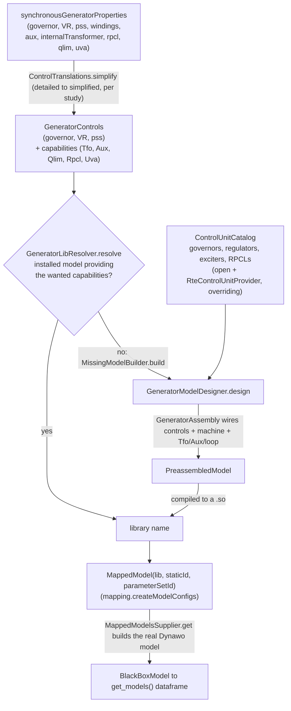

# From a machine's controls to a Dynawo model

This branch turns what a synchronous generator *carries* — its governor, voltage regulator,
stabiliser, and a few flags — into the Dynawo model a dynamic simulation runs for it. The model may
already be installed, or it may be assembled and compiled on demand. This note names the pieces that
do that and shows how they fit together.

## The pieces

| Piece | Class | What it is |
|---|---|---|
| **Extension** | `SynchronousGeneratorProperties` (`synchronousGeneratorProperties`) | What a machine carries: its governor, voltage regulator, PSS, number of windings, and the flags `auxiliaries` / `internalTransformer` / `rpcl` / `qlim` / `uva`. Put there by a provider (RTE reads a CSV; the open source deduces it from the energy source). |
| **Translation** | `ControlTranslations` / `ControlTranslation` | Turns the *detailed* controls (DynaSwing) into the *simplified* ones (DynaWaltz) a voltage stability study runs. RTE's `RteControlTranslation` sends every governor to `GoverProportional` and each regulator to `VRProportional` / `VRProportionalIntegral`. A control no table names stands for itself. |
| **Controls** | `GeneratorControls` | The `(governor, voltageRegulator, pss)` a model is built from — already simplified where the study is simplified. |
| **Catalog** | `ControlUnitCatalog` + `ControlUnitProvider` | Every control a model can be made of, keyed by the name a model goes by. The open source declares its own; a provider (`RteControlUnitProvider`) adds — and **overrides** — with the RTE governors, regulators, exciters and reactive power control loops. |
| **Control units** | `MachineControlUnit`, `RegulatorControlUnit` | The primitives. A `MachineControlUnit` (governor / regulator / exciter) wires itself to the machine; a `RegulatorControlUnit` (PSS, reactive power control loop) watches the machine and drives a regulator's inputs. A regulator may **drive an exciter**, a downstream control not named in the library. A control's **catalog name** can differ from its Modelica model (`VRFictitious` is the `VRP320` model). |
| **Designer** | `GeneratorModelDesigner` | Reads a name back into an assembly: given the controls, the shape (windings), and the capabilities (transformer, auxiliaries, qlim, rpcl), it looks the units up in the catalog and hands them to the assembly. `name(...)` and `design(...)` are two readings of the same thing. |
| **Assembly** | `GeneratorAssembly` → `PreassembledModel` | Puts the machine, its controls, its exciter and loop, and what stands between it and the grid (transformer, coupling, auxiliaries) into one model and wires them. |
| **Naming** | `ModelNaming` / `RteModelNaming` | What a Dynawo release, or a deployment's own library, calls the parts. RTE takes the generator transformer init from its own library (`GeneratorTransformerAuxExt_INIT`). |
| **Resolver** | `GeneratorLibResolver` + `GeneratorCapability` | The decision: does an **installed** model already provide the controls and capabilities wanted? If so, use it. If not, ask the designer (through the builder) to make one. |
| **Builder** | `MissingModelBuilder` | Compiles a designed `PreassembledModel` into a `.so` in the deployment's built-models directory, and returns its library name. |
| **Mapping** | `RteSynchronousGeneratorMapping` / `UniversalSynchronousGeneratorMapping` | The RTE part: per machine, decide simplified vs detailed, then resolve. Produces a `MappedModel(lib, staticId, parameterSetId)` for each generator. |
| **Supplier** | `MappedModelsSupplier` → `get_models` | Stands each `MappedModel` up into the actual Dynawo `BlackBoxModel` (through the catalog) — the same models a simulation runs — and reads them into the `get_models()` dataframe. |

## How they interact

The dividing line is **installed vs generated**. The resolver always prefers an installed model; the
designer, catalog, assembly and builder only come into play for a combination nobody shipped —
which is what lets a machine be modelled without settling for the nearest catalogued model.

## Examples

**1 — A detailed machine, model already installed.** A machine carries `GoverAnsal` / `VRAnsal`,
3 windings, on a 400 kV node. A DynaSwing study keeps the controls detailed. The resolver asks the
catalog which installed model implements them with a transformer and finds
`GeneratorSynchronousThreeWindingsGoverAnsalVRAnsalTfo` — nothing is designed or built.

**2 — A detailed machine whose model was never shipped.** Same machine, but no installed model
matches. The resolver falls through to the builder, which asks the designer. The designer looks
`GoverAnsal` and `VRAnsal` up in the catalog (RTE units), the `GeneratorAssembly` wires them to the
machine and a generator transformer whose init is RTE's `GeneratorTransformerAuxExt_INIT`, and the
result is compiled into `GeneratorSynchronousThreeWindingsGoverAnsalVRAnsalTfo`.

**3 — A simplified machine with reactive limits and a control loop.** A DynaWaltz study simplifies
the controls to `GoverProportional` / `VRProportional`. The machine's `qlim` and `rpcl` flags become
the `QLIM` and `RPCL2` capabilities. If no installed model provides them, the designer builds one:
it stands the regulator on its reactive-limits variant (`VRProportionalReactiveLimits`, the RTE Astre
model overriding the open one) and adds a `ReactivePowerControlLoop2` that drives the regulator's
`UsRefPu` / `limitationUp` / `limitationDown`. The library is
`GeneratorSynchronousFourWindingsProportionalRegulationsQlimRpcl2`.

**4 — The fictitious regulator.** A machine names `VRFictitious`, a regulator no distinct model
implements. The catalog answers that name with the `VRP320` model (its catalog name decoupled from
its Modelica name), so the library is named for the fictitious regulator while the model wired in is
`VRP320`.
